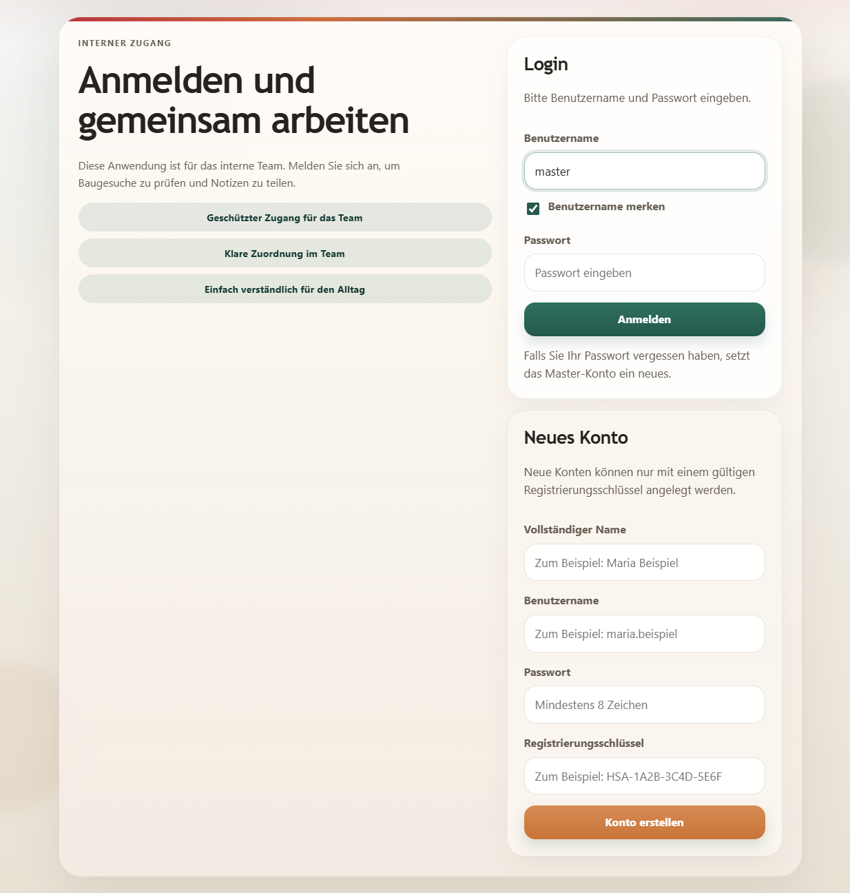
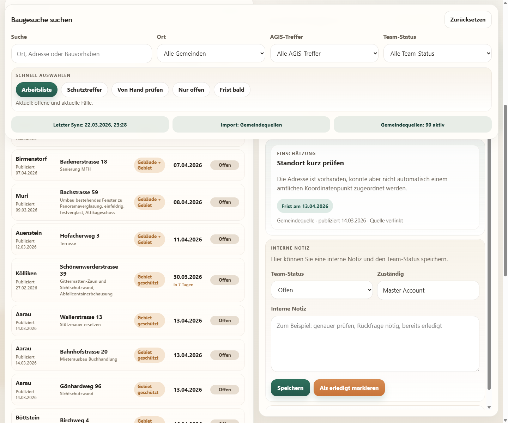
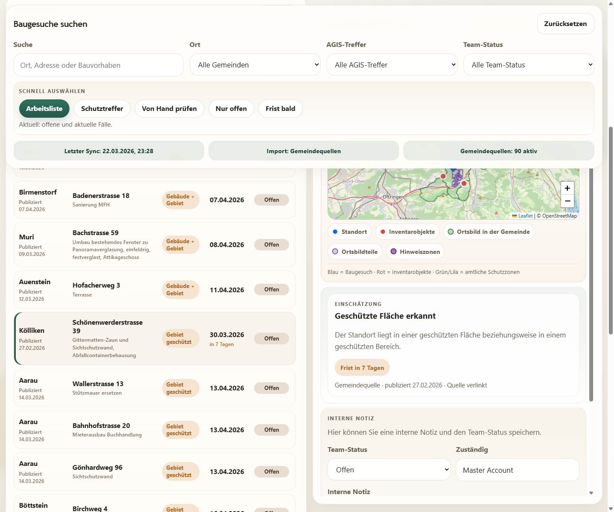
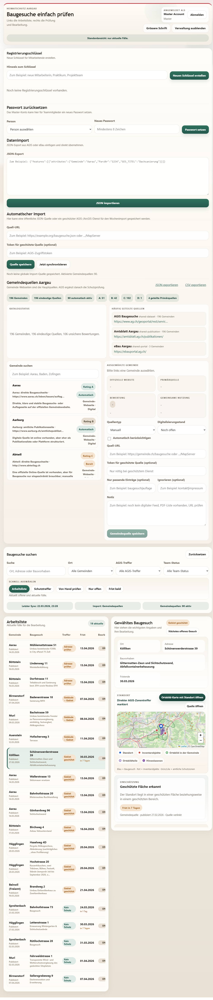

# Abschlussdokumentation

## Projektstand

Die Anwendung ist als interner Pilot für den Heimatschutz Aargau fertig aufgebaut. Sie verbindet offizielle Gemeindequellen mit amtlichen AGIS-Daten und stellt dem Team eine klare Arbeitsoberfläche für Sichtung, Bewertung und Bearbeitung von Baugesuchen bereit.

## Abdeckung aller Aargauer Gemeinden

Der aktuelle Systemstand führt einen vollständigen Gemeinden-/Quellenkatalog für alle 196 Aargauer Gemeinden.

Aktueller Reportstand:
- 196 Gemeinden erfasst
- 196 eindeutige Primärquellen im aktuellen Seed
- 4 Gemeinden mit geteilter Primärquelle
- 3 häufig geteilte Zusatzquellen
- 106 unsichere Bewertungen

Rating-Verteilung:
- `A`: 51
- `B`: 42
- `C`: 102
- `D`: 1

Hauefig gemeinsam genutzte Quellen:
- `AGIS Baugesuche`
- `Amtsblatt Aargau`
- `eBau Aargau`

Die Quellen sind im System von den Gemeinden getrennt modelliert. Eine Gemeinde kann damit auf mehrere Quellen verweisen, und eine Quelle kann mehreren Gemeinden zugeordnet sein.

## Gestalterischer Endstand

Die Oberfläche wurde bewusst an öffentlichen digitalen Auftritten ausgerichtet:

- ruhige, sachliche Farbpalette
- klare Hierarchie zwischen Arbeitsliste und Detailansicht
- reduzierte Bedientexte
- grosse, gut lesbare Eingaben und Statuschips
- konsistente Panel- und Kartenstruktur

Als Orientierung dienten offizielle, zurückhaltende Webmuster aus dem Umfeld von Kanton und Bund, insbesondere die öffentliche Gestaltung des Kantons Aargau und die Schweizer Bundes-Styleguide-Prinzipien für klare Informationsdarstellung.

## Fachliche Logik

### Was die App automatisch macht

- offizielle Gemeindequellen abrufen
- relevante Baugesuche aus Detailseiten oder Publikations-PDFs ableiten
- unzuverlässige News-/Archiv-/Eventeinträge ausfiltern
- Adressen und Parzellen normalisieren
- möglichst amtlich geokodieren
- AGIS-Treffer gegen Schutzflächen und Inventarobjekte prüfen
- Hinweise und Schutzstatus speichern

### Was bewusst manuell bleibt

- Fälle ohne genug genaue Adresse oder nur mit Parzellenangabe
- fachliche Endbeurteilung
- interne Priorisierung, Notizen und Kommentare

## Screenshots

### 1. Login

Die Anwendung trennt internen Zugang und Registrierung klar. Benutzer melden sich mit Benutzername und Passwort an; neue Konten brauchen einen Registrierungsschlüssel.



### 2. Arbeitsliste

Die Standardansicht ist auf aktuelle und offene Fälle reduziert. Suche, Filter und Schnellauswahl stehen oben; links steht die Arbeitsliste, rechts die Bearbeitung des gewählten Falls.



### 3. Detailansicht mit AGIS

Bei einem Schutztreffer zeigt die Karte Standort, rote Inventarobjekte und amtliche Kontextzonen. Die Bewertung bleibt kompakt und ist direkt unter der Karte lesbar.



### 4. Verwaltungsbereich

Das Master-Konto kann Schlüssel, Passwörter, Datenimporte, automatische Sync-Quellen und Gemeindequellen zentral verwalten. Der neue Verwaltungsbereich zeigt zusätzlich Katalogreport, gemeinsame Quellen, Qualitätsrating und Exportfunktionen.



## Aufbau der Anwendung

### Linke Seite

- Arbeitsliste
- Suche und Filter
- AGIS-Treffer
- Frist
- Team-Status

### Rechte Seite

- Stammdaten des ausgewählten Falls
- Karte
- Einschätzung
- interne Notiz
- Team-Austausch

### Verwaltungsbereich

- Registrierungsschlüssel
- Passwort-Reset
- JSON-Import
- automatische Sync-Quelle
- Gemeindequellen Aargau

## Verwendete offizielle Daten

Die Anwendung setzt auf amtliche Quellen:

- offizielle Gemeinde-Publikationsseiten
- offizielle Gemeinde-PDFs für Baugesuche
- AGIS-/ArcGIS-Layer des Kantons für Schutzprüfung
- optional geschützte AGIS-/eBau-Quellen mit Token
- offizieller Schweizer Suchdienst für Geokodierung

Nicht als Hauptquelle vorgesehen:

- allgemeine Newsseiten
- Eventseiten
- Social-Media-Seiten
- unscharfe Archivseiten ohne belastbare Baugesuchsinformation

## Test- und Abnahmestand

Der Endstand wurde lokal geprüft:

- `42` automatisierte Tests erfolgreich
- Syntaxprüfung von Frontend und Backend erfolgreich
- manuelle UI-Prüfung mit Playwright MCP erfolgreich
- Screenshots stammen aus der laufenden lokalen Anwendung

## Produktive Bereitstellung

Für den internen Pilot ist Railway mit Volume vorgesehen.

Pflichtvariablen:

```env
DATABASE_PATH=/data/heimatschutz.sqlite
MASTER_ACCOUNT_PASSWORD=...
DEFAULT_LOGIN_PASSWORD=...
NODE_ENV=production
PORT=3000
```

Optional für eine echte geschützte Vollautomatik:

```env
SYNC_SOURCE_URL=...
SYNC_SOURCE_TOKEN=...
AUTO_SYNC_ENABLED=true
AUTO_SYNC_INTERVAL_HOURS=168
AUTO_SYNC_RUN_ON_START=true
```

## Offene technische Grenze

Die Anwendung ist im internen Pilot einsatzbereit. Was für die volle kantonale Vollautomatik noch fehlt, ist kein Frontend- oder Importproblem mehr, sondern ein echter Zugriff auf eine geschützte Gesamtquelle oder ein offizieller periodischer Export.

## Verwandte Dokumente

- [README.md](C:/Users/Andrin/OneDrive%20-%20Alte%20Kantonsschule%20Aarau/Desktop/xxxx/repo/README.md)
- [benutzerhandbuch.md](C:/Users/Andrin/OneDrive%20-%20Alte%20Kantonsschule%20Aarau/Desktop/xxxx/repo/docs/benutzerhandbuch.md)
- [systemdokumentation.md](C:/Users/Andrin/OneDrive%20-%20Alte%20Kantonsschule%20Aarau/Desktop/xxxx/repo/docs/systemdokumentation.md)
- [prüfprotokoll.md](C:/Users/Andrin/OneDrive%20-%20Alte%20Kantonsschule%20Aarau/Desktop/xxxx/repo/docs/prüfprotokoll.md)
